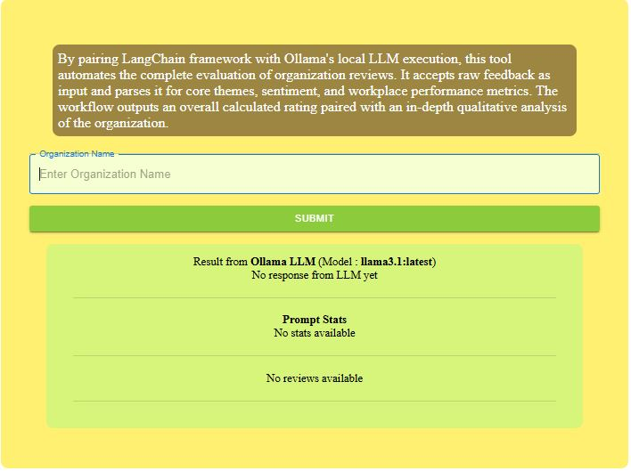
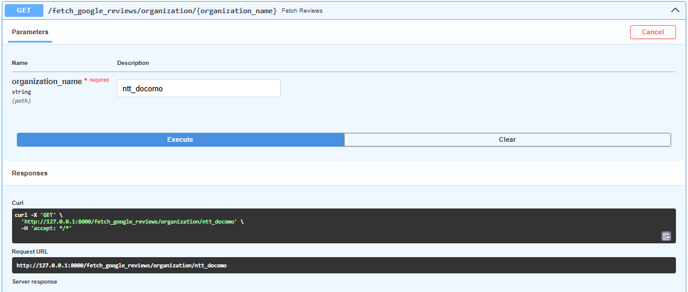
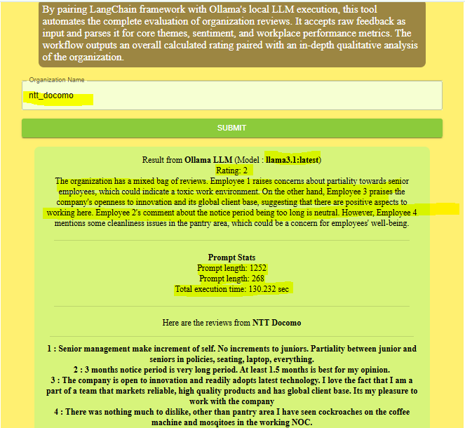
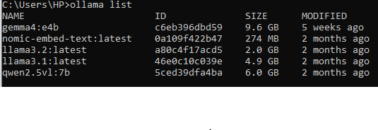

# 🤖 LLM Organization Review Generator

An AI-powered web application that generates organization and employee reviews using **React**, **FastAPI**, and local **Ollama** LLMs.

---

## 📸 Application Preview

<p align="center">
  
</p>
<p align="center">
  
</p>
<p align="center">
  
</p>
<p align="center">
  
</p>

---

## ✨ Features

- **AI-Powered Review Generation:** Leverages local LLMs via Ollama to generate contextual reviews.
- **FastAPI Backend:** Lightweight, fast, and async API server managed with `uv`.
- **Interactive React UI:** Responsive frontend for inputting details and displaying AI output in real time.
- **100% Local & Private:** Runs entirely on your machine—no external API keys required.

---

## 🛠️ Tech Stack

- **Frontend:** React, Vite, Node.js (`npm`)
- **Backend:** FastAPI, Python (`uv`)
- **LLM Engine:** [Ollama](https://ollama.com/) (Local runner)

---

## 🚀 Local Setup & Run Guide

Follow these steps to run the application on your local machine. Please note,Ollama/LLM performance will depend on the configuration of your hardware. Higher configuration harware might respond faster. Please modify the temperature or add new parameters if required

### Prerequisites

Ensure you have the following installed:
1. **[Node.js](https://nodejs.org/)** (v18+)
2. **[Python](https://www.python.org/)** (v3.10+) and **[uv](https://docs.astral.sh/uv/)**
3. **[Ollama](https://ollama.com/)**

---

### Step 1: Start Ollama

Download and launch your desired LLM model (e.g. I have used model, `llama3.1`):

```bash
ollama run llama3
```
---

### Step 2: Start Backend Server (FastAPI)

Backend runs at http://localhost:8000

```bash
cd backend
uv run uvicorn app:main --reload
```
---

### Step 3: Start Frontend Server (React)

Frontend web app runs at http://localhost:5173

```bash
cd frontend
cd web
npm run dev
```
---

### How to Use


Ensure you have the following installed:
1. Ensure Ollama is running in the background. Check Ollama info screenshot for the models you have locally.
2. Launch both backend and frontend servers using the steps above.
3. Open http://localhost:5173 in your browser for React.
4. Open http://127.0.0.1:8000/docs in your browser for FatsAPI Swagger.
5. Input details into the organizational name textbox and click Generate to retrieve AI-generated reviews in real time. Make sure you have HARD CODED KEYS for the DEMO purpose. Change them or integrate yout API in place.